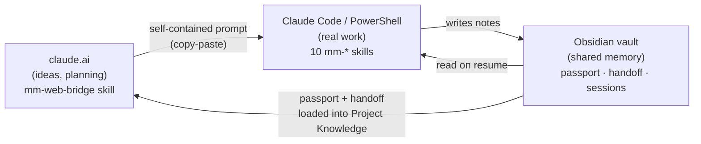

<div align="center">

# mm — markdown memory & workflow system

**A file-based memory and prompt bridge that connects claude.ai (where you think) ↔ Claude Code (where you build) ↔ Obsidian (shared long-term memory).**

[](LICENSE)


-lightgrey.svg)

<!-- TODO: record a short terminal demo (asciinema / GIF) and drop it here -->
<!--  -->

</div>

---

## What is this?

When you build with Claude, your work is split across two places: you sketch ideas and plan in **claude.ai**, then do the real work in **Claude Code** in your terminal. Those two sides don't share memory, and context evaporates between sessions, between chats, and whenever the context window compacts.

**mm** closes that gap. It's a set of [Claude Agent Skills](https://docs.claude.com/en/docs/agents-and-tools/agent-skills/overview) plus a small PowerShell installer that gives you:

- **One shared memory** for every project, stored as plain markdown in an Obsidian vault (passport, handoff, session history).
- **A prompt bridge** so an idea worked out in claude.ai becomes a clean, self-contained task you paste into Claude Code.
- **A simple lifecycle** — start a project, resume it, save a session, hand off to a new chat — with no copy-pasting your whole history every time.

Everything is markdown and files. No database, no cloud, no lock-in.

---

## How it works

mm spans three environments that share state through files, not magic:



- **claude.ai side** is a single skill (`mm-web-bridge`): it challenges your idea, checks fast-moving tech against the live web, and composes the prompt you'll run in Claude Code.
- **Claude Code side** is 10 `mm-*` skills that do the work and keep the vault up to date.
- **Obsidian** is just the folder where the markdown lives. Obsidian indexes it for you; mm reads and writes the files directly.

---

## Quick start

### Prerequisites

- [Claude Code](https://docs.claude.com/en/docs/claude-code) CLI
- Windows + PowerShell (primary platform — see [Cross-platform](#cross-platform) below)
- An Obsidian vault (any folder works; Obsidian itself is optional but recommended)

### Install (Claude Code side)

```powershell
# 0. (first time only) launch Claude Code once so ~/.claude/skills exists
# 1. Clone
git clone https://github.com/mworldorg/markdown-memory.git
cd markdown-memory

# 2. Register the skills (junctions into ~/.claude/skills + sets MM_REPO_ROOT)
#    If PowerShell blocks the script, run instead:
#    powershell -ExecutionPolicy Bypass -File scripts/register-skills.ps1
powershell scripts/register-skills.ps1

# 3. RESTART Claude Code (skills load at session start), then personalize:
/mm setup

# 4. Create your first project's passport (run inside the project folder):
/mm new
```

### Connect the claude.ai side

1. Create a Project in claude.ai for your work.
2. Add your project's `passport.md` and `handoff.md` to **Project Knowledge**.
3. Load the `mm-web-bridge` skill into that Project (claude.ai → Customize → Skills → Upload a skill). After `/mm setup`, upload your personalized copy from `claude-ai-skills/_generated/mm-web-bridge/` — the committed `claude-ai-skills/mm-web-bridge/` is a template with placeholder persona.
4. First message in a new chat:
   > *"Read handoff.md and passport.md, tell me where we are and suggest the next step."*

### The loop

```text
/mm resume   →   discuss in claude.ai   →   paste prompt into Claude Code   →   /mm save   →   /mm next
```

---

## Skills

Ten skills on the Claude Code side, plus one on the claude.ai side — and vendored external skills (see [Integrations](#integrations)).

| Skill | What it does |
|---|---|
| `mm` | Dispatcher — short aliases for everything below |
| `mm setup` | One-time personalization after cloning |
| `mm-init-project` | Create a project passport + structure in the vault |
| `mm-resume` | Load passport + dashboard + last session on start |
| `mm-projects` | One-screen overview of all projects (read-only) |
| `mm-bridge` | Wrap a task into a prompt framework for Claude Code |
| `mm-handoff` | Generate the cross-chat handoff summary |
| `mm-save-session` | Capture decisions and progress into the vault |
| `mm-instructions` | Manage project instructions |
| `mm-doctor` | Health checks, version sync, consistency with passport |
| `mm-web-bridge` *(claude.ai)* | Idea partner + prompt composer in the browser |
| `ecc-security-review` *(vendored — [ECC](https://github.com/affaan-m/everything-claude-code), MIT)* | Security checklist: secrets, input validation, SQLi, auth, XSS/CSRF, rate limiting |
| `ecc-search-first` *(vendored — [ECC](https://github.com/affaan-m/everything-claude-code), MIT)* | Research before coding: search existing tools/libs/MCP/skills, then adopt / extend / build |

---

## Integrations

mm cooperates with several external tools and bodies of work. Where it builds on someone else's project, that project keeps its own license and attribution.

- **GSD** — phase-based planning framework. mm **reads** GSD state (`.planning/` / `.gsd/`) and cooperates with it; it never writes there. *(deepest integration)*
- **Karpathy guidelines** — four meta-principles (think before coding, simplicity first, surgical changes, goal-driven) applied across both the Claude Code and claude.ai sides. MIT. *(external Claude Code plugin — install separately, see Optional plugins below)*
- **[context-mode](https://github.com/mksglu/context-mode)** — in-session context optimization and continuity. See [Memory layers](#two-memory-layers) for how it relates to mm. Elastic License 2.0 (source-available). *(external Claude Code plugin — install separately, see Optional plugins below)*
- **prompt-frameworks** — CRISPE / XML / PERSONA / HYPOTHESIS templates used by `mm-bridge`. Inspired by [awesome-claude-prompts](https://github.com/langgptai/awesome-claude-prompts), MIT.
- **[claude-code-telegram](https://github.com/RichardAtCT/claude-code-telegram)** — optional Telegram bridge, off by default. MIT.
- **[ECC — everything-claude-code](https://github.com/affaan-m/everything-claude-code)** — two skills vendored per-piece into `vendor/`: `ecc-security-review` (markdown security checklist; renamed to avoid clashing with the built-in `/security-review`) and `ecc-search-first` (research-before-coding workflow). The rest of ECC (AgentShield, plugin, hooks, ~246 skills) is **not** included. MIT © Affaan Mustafa. *(per-skill vendoring mechanism — see [`vendor/README.md`](vendor/README.md))*

### Two memory layers

mm and context-mode solve **different** problems and don't overlap:

- **context-mode** keeps a *single session* alive — it survives auto-compaction and `--resume` by rebuilding your working state inside Claude Code.
- **mm** keeps *long-term project history* — decisions, handoffs, and session notes that persist across sessions and across chats, in the Obsidian vault.

If you use both, context-mode already handles compaction; mm doesn't try to.

### Optional plugins

Karpathy guidelines and context-mode are external Claude Code plugins (not bundled in this repo). mm cooperates with them but works without them. To install:

```text
# Karpathy coding guidelines (think-before-coding, simplicity, surgical, goal-driven)
/plugin marketplace add forrestchang/andrej-karpathy-skills
/plugin install andrej-karpathy-skills@karpathy-skills

# context-mode (in-session context optimization + continuity across compaction)
/plugin marketplace add mksglu/context-mode
/plugin install context-mode@context-mode
```

---

## Cross-platform

mm is cross-platform! It is fully supported on Windows, macOS, and Linux:
- **Windows**: Use `powershell scripts/register-skills.ps1` for PowerShell or `python3 scripts/register-skills.py`.
- **macOS / Linux**: Use `python3 scripts/register-skills.py` (which sets up symlinks in `~/.claude/skills` and exports `MM_REPO_ROOT` in your shell profile like `.zshrc` or `.bashrc`).

For the optional Telegram bridge:
- **Windows**: Use `powershell scripts/install-tg-bridge.ps1`.
- **macOS / Linux**: Use `python3 scripts/install-tg-bridge.py`.

---

## Conventions

- **Personal data never lands in committed files.** Your name and paths live in a gitignored `mm-config.local.json` written by `/mm setup`. The committed config stays a generic template.
- **Single source of truth for versions** — `config.version`. Per-skill `version:` fields are intentionally granular.
- **Skills preview before they write**, and never write into GSD's `.planning/` / `.gsd/`.

---

## Documentation

- [`passport.md`](templates/passport.md) — the per-project source of truth (architecture, conventions, constraints)
- [`docs/`](docs/) — deeper guides (Telegram bridge, config loading, etc.)

---

## Contributing

Issues and PRs welcome. New skills go in `skills/your-skill/SKILL.md` with YAML frontmatter; claude.ai skills go in `claude-ai-skills/` (they are **not** junctioned into Claude Code).

## License

MIT — see [LICENSE](LICENSE). Integrated projects retain their own licenses (see [Integrations](#integrations)).
